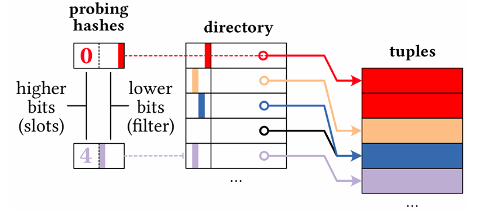

# SIGMOD 2025 Contest Submission

## Overview

This repository contains our final implementation for the SIGMOD 2025 Programming Contest, based on the official contest repository:

https://github.com/SIGMOD-25-Programming-Contest/contest-sigmod2025

The current version of the project documents only the implementation that is still active in the codebase. Older experimental variants such as Robin Hood, Hopscotch, and Cuckoo hashing are not part of the current build flow and are therefore omitted from this README.

Our work focuses on optimizing the contest execution engine for repeated join-query evaluation on the IMDB workload. The goal of the final version is not only correctness, but also reduced runtime through better data organization, efficient hash-based joins, parallel probing, and a cache-assisted execution flow for repeated experiments.

## Current Implementation

The final engine focuses on fast join execution over the contest plans and uses the components that are currently integrated into the executable targets:

- parallel hash join execution in [src/execute.cpp](src/execute.cpp)
- unchained hash table support in [src/Uhashtable.cpp](src/Uhashtable.cpp)
- column-oriented processing in [src/column_store.cpp](src/column_store.cpp)
- late materialization utilities in [src/late.cpp](src/late.cpp)
- cached execution support through the `build_cache` and `fast` targets

At runtime, the main execution path builds a hash table on integer join keys, probes it in parallel, and materializes the requested output columns from the intermediate column representation.

## Data Representation

### Column Store for Intermediate Results

The engine keeps intermediate results in a column-oriented structure instead of a row-store layout.

- each logical column is represented by `column_t`
- each `column_t` stores its values inside paged buffers (`ColumnPage`)
- values of the same column are stored contiguously, improving cache locality during scans and join processing

### `value_t` Runtime Encoding

To avoid the overhead of a generic variant-based representation, the project uses a compact 64-bit runtime value called `value_t`.

The encoding supports four cases:

- `INT32`
- `INT32_NO_NULL`
- `VARCHAR`
- `NULL`

For plain `INT32`, the integer value is stored directly. For `VARCHAR` and `INT32_NO_NULL`, the value stores metadata pointing back to the original columnar input, specifically table, column, page, and position. This is the basis for late materialization and for the indexing optimization on no-null integer columns.

### Late Materialization for Strings

VARCHAR values are not copied eagerly into intermediate results. Instead, the engine stores a compact reference in `value_t` and resolves the actual string only when it is needed for final output generation.

This reduces unnecessary string copying during joins and keeps intermediate structures lighter, which is especially useful because result columns are often strings that do not participate in join predicates.

### Indexing Optimization for `INT32` Without `NULL`

For integer columns without null values, the implementation does not need to materialize every value into a new buffer.

- the scan code marks such columns with `is_no_null`
- the intermediate `column_t` keeps pointers to the original input pages through `original_pages`
- join execution can recover the integer value directly from the original page when needed

This follows the assignment requirement to avoid unnecessary copies when the original compact column pages can be indexed directly.

## Hash Join Design

### Unchained Hash Table

The final join path uses a custom `UnchainedHashTable` for integer join keys. Each directory slot also stores a small 16-bit bloom filter to reject many non-matching probes early.

- build-side tuples are collected as `(key, row-position)` pairs
- entries are organized into a compact contiguous array
- a directory indexed by hash prefix points to contiguous ranges of entries



This layout avoids linked-list traversal and improves locality during probing, which is one of the main reasons it performs better than a more naive chained design for this workload.

### Parallel Execution

The final version also includes parallel execution support in the join path.

- probing is executed by multiple worker threads
- work distribution is coordinated through an atomic counter
- when a thread finishes its current work, it can continue with the next available page
- each thread produces local result pages, which are merged after all worker threads finish

The phased design keeps synchronization simple while still exploiting multiple cores effectively.

## Build

Run all commands from the project root.

1. Download the IMDB dataset.

```bash
./download_imdb.sh
```

2. Configure the project.

```bash
cmake -S . -B build -DCMAKE_BUILD_TYPE=Release -Wno-dev
```

3. Build the binaries.

```bash
cmake --build build -- -j $(nproc)
```

## Running

### Prepare DuckDB for correctness checks

```bash
./build/build_database imdb.db
```

### Run the standard contest driver

```bash
./build/run plans.json
```

### Run the cached fast path

On Unix systems, the repository also provides cache-based execution targets for faster repeated runs.

1. Build cache files:

```bash
./build/build_cache plans.json
```

2. Execute using the cache:

```bash
./build/fast plans.json
```

## Repository Layout

```text
pro_sigmod/
├── include/        # headers for execution, storage, and helper structures
├── job/            # JOB benchmark SQL workload
├── src/            # implementation of the final engine
├── tests/          # driver programs and unit tests
├── CMakeLists.txt  # build configuration
├── download_imdb.sh
└── plans.json
```

## Notes

- the contest template and input format come from the official SIGMOD 2025 contest repository
- this README describes the current state of this repository, not earlier intermediate project milestones

## Contributors

https://github.com/sdi2200200